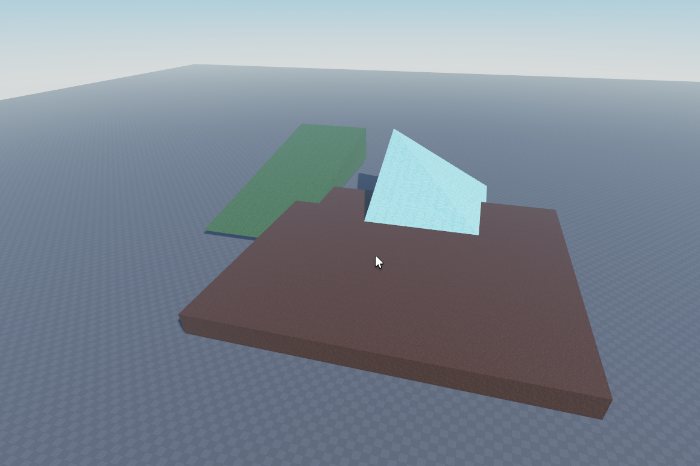
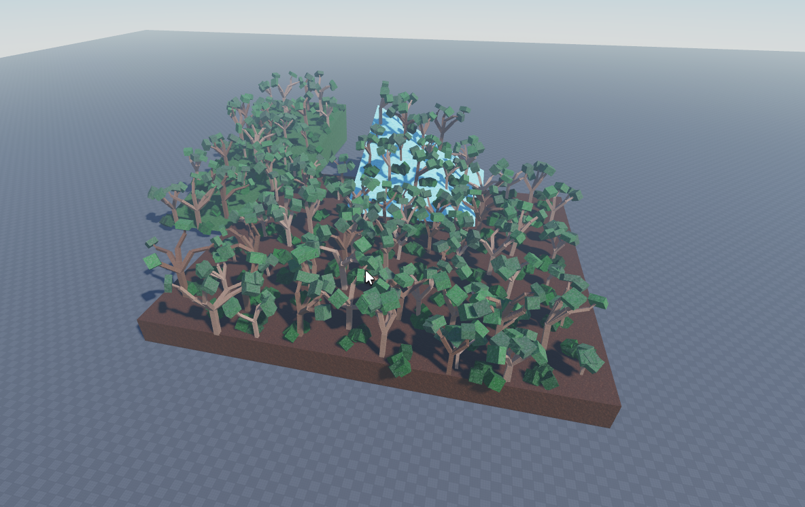

# 🌲 Roblox-Studio-Tree-Generator 🌲
This is a simple forest generator for Roblox Studio that I made for another project. It can create bushes and trees on top of blocks, wedges and corner wedges.

⚠️ **Note:** Support for **cylinders**, and **spheres** is only confirmed to work in the development branch.

## Example Forest

<div align="center">
   
  
</div>

## **📌 How To Use**
1. Download the `ForestScripts.rbxm`
2. Drag the file into your Roblox Studio Experience. It will convert into a folder with module scripts inside
3. Go to `ServerStorage` and create a `ModuleScripts` folder (if it doesn't already exist)
4. Put the `ForestScripts` folder into the `ModuleScripts` folder (the folder has to be here)
5. To generate a forest you first have to make two tables of points using `ForestGeneration.createForestOnModel(Model)`  
*The `ForestModel` has to be made and loaded into a variable*

```lua
    local TreePointTable = ForestGeneration.createForestOnModel(ForestModel)

    local BushPointTable = ForestGeneration.createForestOnModel(ForestModel)
```
6. Then iterate over every point and create a tree or bush depending on the table using `Tree.CreateNewTree(folder, point)` or `Bush.CreateNewBush(folder, point)`

```lua
	for _, point in pairs(TreePointTable) do	
		Tree.CreateNewTree(TreeFolder, point)
	end

	for _, point in pairs(BushPointTable) do
		Bush.CreateNewBush(BushFolder, point)
	end
```
## **🌿 Using Individual Module Scripts**

If you want to use only the tree or bush script separately all scripts need to be in `ServerStorage > ModuleScripts > ForestScripts` and you have to have the `corresponding settings script` and the `ForestGeneration script` for points.


## **🌿 Using custom points**

You can pass any point you want into `CreateNewBush()` or `CreateNewTree()` but they have to be `Vector3` points.


## **⚙️ Settings**

The generation can be customized using the `ForestSettings`, `TreeSettings`, and `BushSettings` module scripts. 
- `ForestSettings.maxPointPlaceAttempts`: Increasing this will create more points to place trees \ bushes
- `ForestSettings.PoissonDiskSamplingRadius`: Controls the spacing between points for trees and bushes 
- All `other settings` are `self-explanatory` and can be `experimented` with, but I will add some explanation for all of them at some point.

## **📌 How To Use the Demo**

1. Create a new `Roblox Studio Experience`
2. Drag the `ForestTestModel.rbxm` into the `Workspace` directory
3. Create a `ModuleScripts` folder in `ServerStorage`
4. Place the `ForestScripts.rbxm` into the `ModuleScripts` folder
5. Place the `ForestDemoScript.rbxm` into the `ServerScriptService`

Then you're good to go :)

Note: .rbxm files will turn into files or folders and will not be .rbxm files once put in Roblox Studio

## **📌 How To Create One Time Forests**

Use this method if you want to generate a forest once and then save it as part of an Experience

1. Follow the `📌 How To Use` instructions at the top of the page
2. Click `Play` to run the game and generate a forest on your custom model
3. While the game is running, select `Current: Client` (right next to play)
4. Under the `Explorer` tab go to the `Workspace` directory and find the folders you passed into `CreateNewTree` and `CreateNewBush`
5. Select the `folder(s)` and copy them `(Ctrl + C)`
6. Click `Stop` to end the game
7. Select the `Workspace` directory and then paste `(Ctrl + V)`
8. The generated folders from runtime should now be saved permanently as part of your game, and you can edit them as needed

**Note:** *The script will continue to generate on top of the saved models if you do not disable it*

## **⚠️Missing Patches⚠️**

The points that are generated use a grid structure to evenly space themselves (Poisson Disk Sampling) so `if your object is not aligned with the X, Y, or Z axes` you will most likely see missing patches `towards the edges`. This has been fixed in the development branch.
